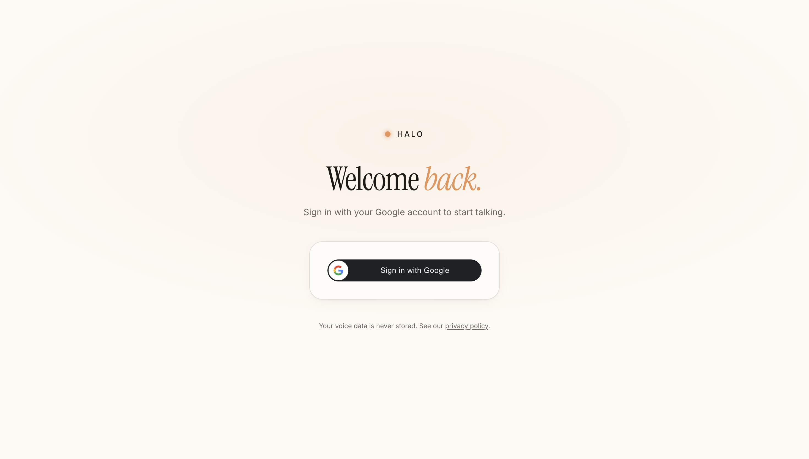
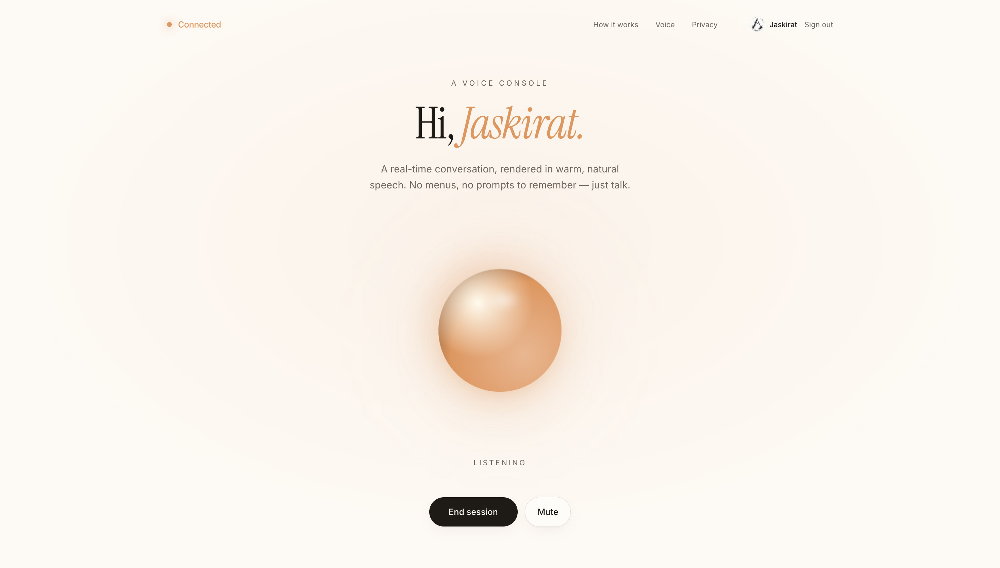
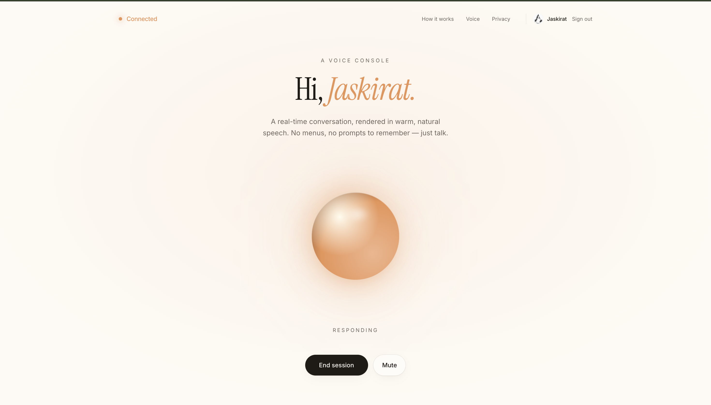
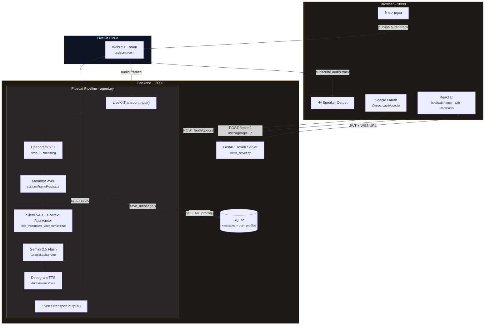
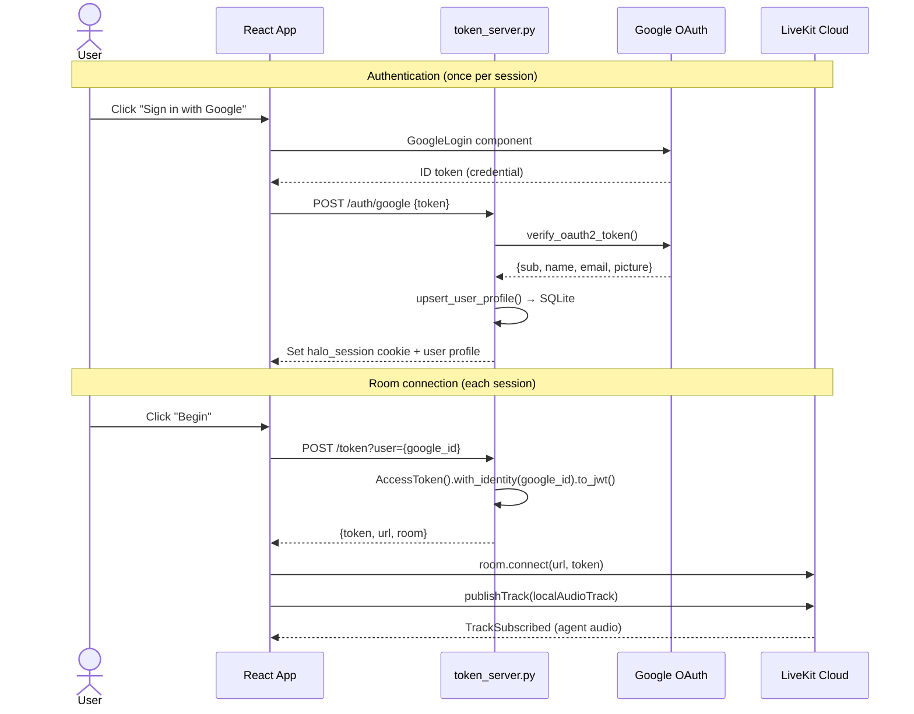
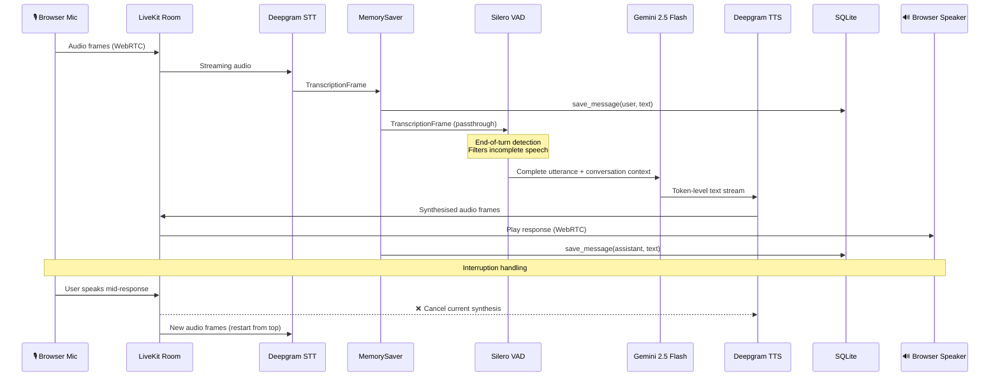

<div align="center">

# Halo

**A real-time voice assistant that listens, thinks, and speaks — all under 800 ms.**

Built with [Pipecat](https://github.com/pipecat-ai/pipecat) · [LiveKit](https://livekit.io) · [Gemini](https://ai.google.dev) · [Deepgram](https://deepgram.com)


</div>

---

Halo is a full-duplex voice assistant you talk to in your browser. You speak into your mic, audio streams over WebRTC to a Pipecat agent, which runs a streaming **STT → LLM → TTS** pipeline and sends synthesised speech back — in real time. It remembers your conversations across sessions and addresses you by name via Google OAuth.

## Screenshots

### Landing / Sign-in


### Listening State


### Speaking State


## Architecture

### System Overview



### Token & Auth Flow



### Voice Pipeline Flow



## Tech Stack

| Layer | Technology | Details |
|---|---|---|
| **STT** | Deepgram Nova-2 | Streaming WebSocket, real-time transcription |
| **LLM** | Google Gemini 2.5 Flash | `GoogleLLMService`, dynamic system prompt per user |
| **TTS** | Deepgram Aura | Asteria voice (`aura-asteria-en`) |
| **Pipeline** | Pipecat | Frame-based orchestration, `FrameProcessor` subclass for memory |
| **VAD** | Silero VAD | Turn detection, `filter_incomplete_user_turns=True` |
| **Transport** | LiveKit Cloud | WebRTC rooms, bidirectional audio tracks |
| **Backend** | FastAPI + SQLAlchemy | Token issuance, HMAC-signed session cookies, SQLite persistence |
| **Frontend** | React 19 + Vite 7 | TanStack Router, `livekit-client` SDK (raw Room API) |
| **Styling** | Tailwind CSS v4 | OKLCH colour system, Instrument Serif + Inter typography |
| **Auth** | Google OAuth 2.0 | `@react-oauth/google`, server-side token verification |

## Key Features

- **Full streaming pipeline** — audio frames flow through STT → LLM → TTS without waiting for complete utterances. No batching, no polling.
- **Natural turn-taking** — Silero VAD detects speech boundaries. Incomplete turns are filtered to prevent hallucinations on background noise. Interruption support lets you cut Halo off mid-sentence.
- **Persistent memory** — Conversations are saved to SQLite per user (keyed by Google ID) and restored on reconnect. Last 20 messages loaded as context.
- **Per-user personalisation** — Google OAuth sign-in. The agent resolves each LiveKit participant's identity by matching SID → identity, loads their profile, and dynamically updates its system prompt with their first name.
- **Custom `MemorySaver` processor** — A Pipecat `FrameProcessor` subclass that intercepts `TranscriptionFrame` and `TextFrame` in the pipeline, buffering assistant tokens and flushing on sentence boundaries (`.`, `!`, `?`).
- **Reactive orb UI** — A warm, animated orb responds to audio levels via `requestAnimationFrame`-driven RMS metering. States: `idle` → `connecting` → `listening` → `thinking` → `speaking`.
- **Connection status indicator** — `BrandIndicator` component shows real-time connection state with animated dot and colour transitions.

## Prerequisites

- **Python 3.11+**
- **Node.js 18+** (or [Bun](https://bun.sh))
- A [LiveKit Cloud](https://cloud.livekit.io) project (free tier works)
- A [Deepgram](https://console.deepgram.com) API key
- A [Google AI Studio](https://aistudio.google.com) API key (for Gemini)
- A [Google Cloud OAuth 2.0 Client ID](https://console.cloud.google.com/apis/credentials) with `http://localhost:9090` as an authorised JavaScript origin

## Quickstart

### 1. Clone

```bash
git clone https://github.com/<your-username>/halo.git
cd halo
```

### 2. Configure environment

```bash
cp .env.example .env
# Fill in your actual keys — see the table below
```

### 3. Backend

```bash
python -m venv venv
source venv/bin/activate       # Windows: venv\Scripts\activate
pip install pipecat-ai[google,deepgram,livekit,silero] \
            fastapi uvicorn sqlalchemy python-dotenv \
            google-auth google-auth-httplib2 livekit-api
```

### 4. Frontend

```bash
cd frontend
npm install       # or: bun install
cd ..
```

### 5. Run

**Option A — One command** (launches all three processes):

```bash
chmod +x start.sh
./start.sh
```

**Option B — Manual** (three terminals):

```bash
# Terminal 1 — FastAPI token server
cd backend && uvicorn token_server:app --port 8000 --reload

# Terminal 2 — Pipecat agent
cd backend && python agent.py

# Terminal 3 — React frontend
cd frontend && npm run dev
```

Open **http://localhost:9090** → sign in with Google → click **Begin** → start talking.

## Environment Variables

Create a `.env` file in the project root. Both `token_server.py` and `agent.py` load from it via `python-dotenv`.

| Variable | Required | Used by | Description |
|---|---|---|---|
| `GOOGLE_API_KEY` | ✅ | `agent.py` | Google AI Studio key for Gemini 2.5 Flash |
| `DEEPGRAM_API_KEY` | ✅ | `agent.py` | Deepgram key for both STT (Nova-2) and TTS (Aura) |
| `LIVEKIT_URL` | ✅ | Both | LiveKit Cloud WebSocket URL (`wss://...livekit.cloud`) |
| `LIVEKIT_API_KEY` | ✅ | Both | LiveKit API key for token generation |
| `LIVEKIT_API_SECRET` | ✅ | Both | LiveKit API secret for token signing |
| `GOOGLE_CLIENT_ID` | ✅ | `token_server.py` | Google OAuth 2.0 Client ID (`.apps.googleusercontent.com`) |
| `DATABASE_URL` | ❌ | `memory.py` | SQLAlchemy connection string. Default: `sqlite:///memory.db` |
| `COOKIE_SECRET` | ❌ | `token_server.py` | HMAC key for session cookies. Falls back to `LIVEKIT_API_SECRET` |

```env
# .env.example
GOOGLE_API_KEY=your_gemini_api_key
DEEPGRAM_API_KEY=your_deepgram_api_key
LIVEKIT_URL=wss://your-project.livekit.cloud
LIVEKIT_API_KEY=your_livekit_api_key
LIVEKIT_API_SECRET=your_livekit_api_secret
DATABASE_URL=sqlite:///memory.db
GOOGLE_CLIENT_ID=your_client_id.apps.googleusercontent.com
```

## Project Structure

```
voice-assistant/
├── backend/
│   ├── agent.py              # Pipecat pipeline — STT → LLM → TTS, MemorySaver, per-user personalisation
│   ├── token_server.py       # FastAPI — /token, /auth/google, /auth/me, /auth/logout
│   ├── memory.py             # SQLAlchemy models (Message, UserProfile), CRUD helpers
│   ├── pipeline_test.py      # Local mic/speaker test (ElevenLabs TTS, no LiveKit)
│   └── Procfile              # Railway: web + agent processes
├── frontend/
│   ├── src/
│   │   ├── components/
│   │   │   ├── VoiceConsole.tsx    # LiveKit room lifecycle, audio metering, transcript bubbles
│   │   │   ├── Orb.tsx             # Animated orb — radial gradients, scale from audioLevel
│   │   │   ├── SignInGate.tsx      # Google sign-in gate (wraps app)
│   │   │   └── BrandIndicator.tsx  # Connection status dot
│   │   ├── lib/
│   │   │   ├── auth-context.tsx    # AuthProvider — cookie-based session, /auth/me on mount
│   │   │   └── connection-context.tsx
│   │   ├── routes/
│   │   │   ├── index.tsx           # Main console — hero, VoiceConsole, feature cards
│   │   │   ├── voice.tsx           # Voice details page
│   │   │   ├── privacy.tsx         # Privacy policy
│   │   │   └── __root.tsx          # Root layout
│   │   ├── styles.css              # Design tokens — oklch palette, warm amber, orb animations
│   │   └── router.tsx              # TanStack Router config
│   ├── vite.config.ts              # Vite 7 — proxy /api → :8000, port 9090
│   └── package.json
├── docs/screenshots/               # Screenshot placeholders
├── start.sh                        # One-command launcher (all three processes)
└── .env                            # API keys (not committed)
```

## Implementation Notes

Things in this codebase that differ from a standard Pipecat example:

| What | Where | Why |
|---|---|---|
| **Custom `MemorySaver` FrameProcessor** | `agent.py:26-53` | Standard Pipecat has no built-in persistence. This subclass intercepts both `TranscriptionFrame` (user speech) and `TextFrame` (LLM tokens) to save turns. Assistant tokens are buffered and flushed on sentence-ending punctuation to avoid saving partial fragments. |
| **`filter_incomplete_user_turns=True`** | `agent.py:139` | Prevents the LLM from receiving and responding to incomplete speech fragments (e.g. background noise picked up by VAD). Not enabled by default in Pipecat. |
| **Dynamic system prompt** | `agent.py:162-198` | On `on_participant_connected`, the agent resolves the LiveKit participant SID → identity, looks up the Google profile in SQLite, and hot-swaps `llm._settings.system_instruction` with the user's first name. |
| **SID → identity resolution** | `agent.py:170-177` | Pipecat's event handler passes the LiveKit SID (`PA_xxx`), not the identity. The code iterates `room.remote_participants.values()` to match SID → identity. |
| **`cancel_on_idle_timeout=False`** | `agent.py:159` | Keeps the agent alive between user sessions instead of shutting down after idle. |
| **`pipeline_test.py` uses ElevenLabs** | `pipeline_test.py:47-52` | The local test script uses `ElevenLabsTTSService` (Rachel voice) + `LocalAudioTransport` for headphone testing. The production `agent.py` uses Deepgram TTS + LiveKit transport. |
| **Vite proxy rewrite** | `vite.config.ts:14-18` | Frontend calls `/api/token` → Vite rewrites to `http://localhost:8000/token`. Avoids CORS in development. |


## Troubleshooting

| Problem | Likely cause | Fix |
|---|---|---|
| **"Token endpoint returned 403/500"** | Backend not running or CORS issue | Ensure `uvicorn token_server:app --port 8000` is up. Check that Vite proxy in `vite.config.ts` points to `:8000`. |
| **No audio from Halo** | Browser autoplay policy | Click anywhere on the page first. The code calls `room.startAudio()` as a fallback, but some browsers still block it. |
| **"Google Sign-In failed"** | OAuth origin mismatch | Add `http://localhost:9090` to your Google Cloud Console → Credentials → Authorised JavaScript origins. |
| **Agent crashes on startup** | Missing API keys | Check `.env` has all required variables. `agent.py` will throw on `None` keys passed to Deepgram/Google/LiveKit. |
| **"Could not resolve participant from room"** | Timing issue | The agent's `on_participant_connected` fires before LiveKit propagates the remote participant. The code falls back to using the SID as identity — the user will get a generic greeting. |
| **Stale ports on restart** | Previous processes still bound | `start.sh` kills processes on `:8000` and `:9090` on startup. If running manually, check `lsof -ti:8000` and `lsof -ti:9090`. |
| **ElevenLabs import error** | Wrong script | `pipeline_test.py` imports ElevenLabs. If you don't have the key or the package, that script will fail — it's a standalone test, not needed for production. |
| **Session cookie not persisting** | Cross-origin cookie issue | In production, set `samesite='none'` and `secure=True` on the cookie in `token_server.py` if frontend and backend are on different domains. |

## License

MIT
